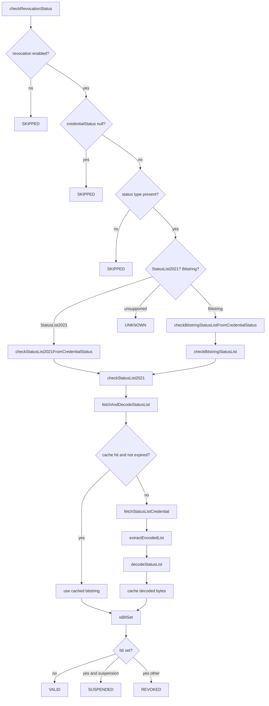
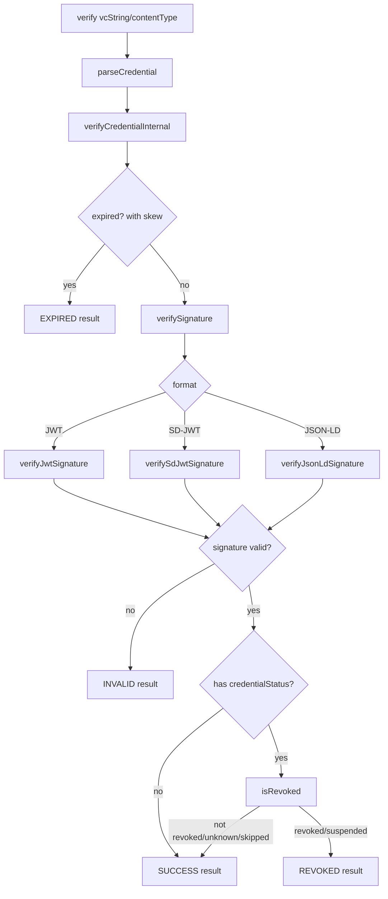
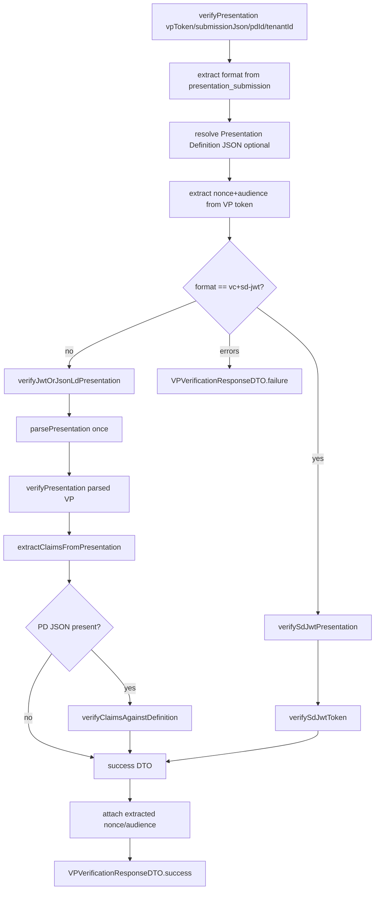
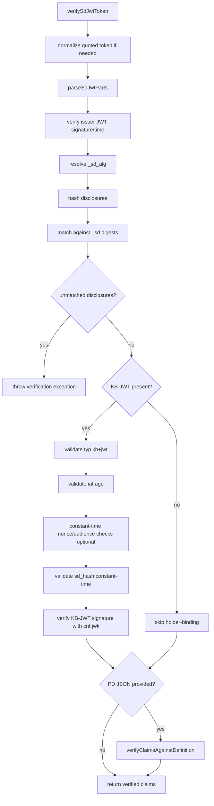

# VC Verification + Status List Method Flow Map

This document covers **every method** in:

1. `StatusListServiceImpl`
2. `VCVerificationServiceImpl`

It includes:
- where each method is called from,
- what each method calls,
- possible control-flow outcomes,
- flowcharts for key paths.

---

## 1) `StatusListServiceImpl` — full method map

## 1.1 High-level flowchart

## 1.2 Method-by-method details

| # | Method | Called by | Calls | Possible flow / outcomes |
|---|---|---|---|---|
| 1 | `checkRevocationStatus(CredentialStatus)` | External callers via `StatusListService` contract; used from `VCVerificationServiceImpl.isRevoked(...)`. | `isStatusList2021`, `checkStatusList2021FromCredentialStatus`, `isBitstringStatusList`, `checkBitstringStatusListFromCredentialStatus`. | Returns `SKIPPED` when disabled/null/missing type; routes to StatusList2021 or Bitstring path; returns `UNKNOWN` for unsupported type. |
| 2 | `checkStatusList2021(String,int,String)` | `checkStatusList2021FromCredentialStatus`, `checkBitstringStatusList`. | `fetchAndDecodeStatusList`, `isBitSet`. | Builds result: `VALID`, `REVOKED`, or `SUSPENDED` based on bit + purpose; wraps unexpected errors in `RevocationCheckException`. |
| 3 | `checkBitstringStatusList(String,int,String)` | `checkBitstringStatusListFromCredentialStatus`. | `checkStatusList2021`. | Delegates to StatusList2021 logic. |
| 4 | `fetchAndDecodeStatusList(String)` | `checkStatusList2021`. | `CachedStatusList.isExpired`, `CachedStatusList.getBitstring`, `fetchStatusListCredential`, `extractEncodedList`, `decodeStatusList`. | Returns cached bytes when valid; else fetches/parses/decodes and caches; wraps network/parse/decode failures. |
| 5 | `isBitSet(byte[],int)` | `checkStatusList2021`. | — | Returns `false` for null/empty/out-of-range; otherwise checks MSB-first bit position. |
| 6 | `clearCache()` | External/admin/test usage. | `Map.clear`. | Clears in-memory status list cache. |
| 7 | `isRevocationCheckEnabled()` | External usage. | — | Returns current enable flag. |
| 8 | `setRevocationCheckEnabled(boolean)` | External config/test usage. | — | Enables/disables revocation checking gate. |
| 9 | `isStatusList2021(String)` | `checkRevocationStatus`. | — | `true` for `StatusList2021Entry` / `StatusList2021`. |
| 10 | `isBitstringStatusList(String)` | `checkRevocationStatus`. | — | `true` for `BitstringStatusListEntry` / `BitstringStatusList`. |
| 11 | `checkStatusList2021FromCredentialStatus(CredentialStatus)` | `checkRevocationStatus`. | `checkStatusList2021`. | Validates URL/index/purpose from credential status; returns `UNKNOWN` for missing/invalid fields; defaults purpose to `revocation`. |
| 12 | `checkBitstringStatusListFromCredentialStatus(CredentialStatus)` | `checkRevocationStatus`. | `checkBitstringStatusList`. | Same as #11 but routes to Bitstring endpoint method; defaults purpose to `revocation`. |
| 13 | `fetchStatusListCredential(String)` | `fetchAndDecodeStatusList`. | `HttpClientUtil.fetchContent`. | Validates URL scheme (`http/https`), performs HTTP GET with Accept header, throws network-style exception on invalid URL/non-OK response. |
| 14 | `extractEncodedList(String)` | `fetchAndDecodeStatusList`. | Gson JSON parsing. | Parses credential JSON, supports wrapped `vc`, handles `credentialSubject` object/array, extracts `encodedList`, throws invalid-status exceptions on malformed structure. |
| 15 | `decodeStatusList(String)` | `fetchAndDecodeStatusList`. | Base64 decode, GZIP inflate. | Decodes Base64+GZIP into bitstring bytes; enforces max decompressed size (2 MB); throws decoding exceptions for bad Base64/GZIP/oversize content. |
| 16 | `CachedStatusList(byte[])` | `fetchAndDecodeStatusList` (cache put). | — | Stores bytes + creation timestamp. |
| 17 | `CachedStatusList.getBitstring()` | `fetchAndDecodeStatusList` cache hit path. | — | Returns cached bitstring bytes. |
| 18 | `CachedStatusList.isExpired()` | `fetchAndDecodeStatusList`. | — | Compares `createdAt` with TTL to determine cache validity. |

---

## 2) `VCVerificationServiceImpl` — full method map

## 2.1 Core VC verification flowchart

## 2.2 Unified VP verification flowchart

## 2.3 SD-JWT verification flowchart

## 2.4 Method-by-method details (all methods)

> Notes:
> - “External” means called by other components via interface/API.
> - Private helper methods are listed with internal caller(s).

### A) Construction and dependency assignment

| # | Method | Called by | Calls | Possible flow / outcomes |
|---|---|---|---|---|
| 1 | `VCVerificationServiceImpl()` | External instantiation. | Creates `DIDResolverServiceImpl`, `SignatureVerifier`, `StatusListServiceImpl`, `ExtendedJWKSValidator`. | Builds default dependency set. |
| 2 | `assignDIDResolverService(DIDResolverService)` | Constructor overloads. | — | Returns passed service reference. |
| 3 | `assignStatusListService(StatusListService)` | Constructor overloads. | — | Returns passed service reference. |
| 4 | `assignPresentationDefinitionService(PresentationDefinitionService)` | 3-arg constructor. | — | Returns passed service reference. |
| 5 | `VCVerificationServiceImpl(DIDResolverService)` | External instantiation. | `assignDIDResolverService`. | Injects DID resolver; uses default other dependencies. |
| 6 | `VCVerificationServiceImpl(DIDResolverService, StatusListService)` | External instantiation. | `assignDIDResolverService`, `assignStatusListService`. | Injects DID resolver + status service. |
| 7 | `VCVerificationServiceImpl(DIDResolverService, StatusListService, PresentationDefinitionService)` | External instantiation. | assignment helpers. | Injects DID resolver + status service + PD service. |

### B) VC verification entry points

| # | Method | Called by | Calls | Possible flow / outcomes |
|---|---|---|---|---|
| 8 | `verify(String vcString, String contentType)` | External via `VCVerificationService`. | 3-arg `verify`. | Delegates with index `0`. |
| 9 | `verify(String vcString, String contentType, int vcIndex)` | External; internal from issuer-trust path through `verifyJWTVCIssuer(String,...)`/`verifyJSONLDVCIssuer(JsonObject,...)`. | `parseCredential`, `verifyCredentialInternal`. | Throws on null/empty VC; returns per-credential result or throws wrapped verification exception. |
| 10 | `verifyCredential(VerifiableCredential)` | External; internal usage possible. | `verifyCredentialInternal`. | Verifies pre-parsed credential. |
| 11 | `verifyCredentialInternal(VerifiableCredential,int)` | `verify`, `verifyCredential`, issuer-overload methods, presentation checks. | `verifySignature`, `isRevoked`. | Expiry check (with skew) -> signature validation -> optional revocation check -> returns `SUCCESS`/`EXPIRED`/`INVALID`/`REVOKED`. |
| 12 | `verifyPresentation(VerifiablePresentation)` | External; called from unified VP path. | `verifyCredentialInternal`. | Fails if no embedded credentials; verifies each VC and returns list of result DTOs. |

### C) Signature verification routing

| # | Method | Called by | Calls | Possible flow / outcomes |
|---|---|---|---|---|
| 13 | `verifySignature(VerifiableCredential)` | `verifyCredentialInternal`, `verifySdJwtToken`. | `verifyJwtSignature`, `verifySdJwtSignature`, `verifyJsonLdSignature`. | Routes by credential format; throws on null/unsupported/verification failures. |
| 14 | `verifyJwtSignature(VerifiableCredential)` | `verifySignature`, `verifySdJwtSignature` (via temp credential). | `VerificationUtil.parseJwtPart`, DID resolver methods, `SignatureVerifier.verifyJwtSignature`, `resolveJwksUri`, `ExtendedJWKSValidator.validateSignature`. | Branches by issuer type: DID-based key resolution, HTTP issuer JWKS discovery, else error; validates header `alg`; handles DID-resolution errors. |
| 15 | `verifySdJwtSignature(VerifiableCredential)` | `verifySignature`. | `parseSdJwtParts`, `verifyJwtSignature`. | Extracts issuer JWT from SD-JWT and verifies as normal JWT signature. |
| 16 | `verifyJsonLdSignature(VerifiableCredential)` | `verifySignature`. | DID resolver, `SignatureVerifier.verifyLinkedDataSignature`. | Requires proof + verification method + proof value/jws; resolves key and verifies linked-data signature. |

### D) Status / validity checks

| # | Method | Called by | Calls | Possible flow / outcomes |
|---|---|---|---|---|
| 17 | `isExpired(VerifiableCredential)` | External + tests + internal utility usage. | — | Returns `false` for null/no expiration; else compares with current time. |
| 18 | `isRevoked(VerifiableCredential)` | `verifyCredentialInternal`. | `statusListService.checkRevocationStatus`. | Returns `false` for no status / skipped / unknown; `true` for `REVOKED` or `SUSPENDED`; wraps revocation-check failures. |

### E) Credential parsing

| # | Method | Called by | Calls | Possible flow / outcomes |
|---|---|---|---|---|
| 19 | `parseCredential(String,String)` | `verify`, VP parsing helpers. | `VerificationUtil.normalizeContentType`, `VerificationUtil.detectFormat`, `parseJwtCredential`, `parseSdJwtCredential`, `parseJsonLdCredential`. | Validates input; auto-detects format for null/generic JSON content type; routes parser by format. |
| 20 | `parseJwtCredential(String)` | `parseCredential`, `parseSdJwtCredential` indirectly for issuer JWT. | `VerificationUtil.parseJwtPart`, `extractVcFields`. | Expects 3 JWT parts; maps JWT claims (`iss`,`sub`,`jti`,`exp`,`iat`/`nbf`) and optional embedded `vc` claim. |
| 21 | `parseSdJwtCredential(String)` | `parseCredential`. | `parseSdJwtParts`, `parseJwtCredential`, `processDisclosures`. | Parses SD-JWT sections, marks format, stores disclosures/KB-JWT, processes revealed claims. |
| 22 | `processDisclosures(VerifiableCredential)` | `parseSdJwtCredential`. | Base64 + JSON parse, `VerificationUtil.parseJsonElement`. | Iterates disclosures; valid ones become credentialSubject claims; malformed disclosure is ignored with debug log. |
| 23 | `parseJsonLdCredential(String)` | `parseCredential`, VP JSON-LD parsing path. | JSON parse, `VerificationUtil.parseDate`, `VerificationUtil.parseJsonElement`, `parseProof`. | Parses context/type/id/issuer/dates/subject/status/proof from JSON-LD VC; throws invalid JSON error when malformed. |
| 24 | `parseProof(JsonObject)` | `parseJsonLdCredential`, `parseJsonLdPresentation`. | — | Maps all recognized proof fields (`type`,`created`,`verificationMethod`,`proofValue`,`jws`,`challenge`,`domain`, etc.). |
| 25 | `extractVcFields(VerifiableCredential, Map<String,Object>)` | `parseJwtCredential`. | — | Pulls `type` and `credentialSubject` (and subject id) from JWT VC claim map. |

### F) VP parsing and nonce/content type helpers

| # | Method | Called by | Calls | Possible flow / outcomes |
|---|---|---|---|---|
| 26 | `parsePresentation(String)` | `verifyNonce`, issuer-trust, unified VP verification. | `VerificationUtil.detectFormat`, `parseJwtPresentation`, `parseJsonLdPresentation`. | Validates token, detects format, routes parser; wraps parser errors. |
| 27 | `parseJwtPresentation(String)` | `parsePresentation`. | `VerificationUtil.parseJwtPart`, `extractVpCredentials`. | Expects JWT structure; parses payload claims (`iss`,`nonce`,`jti`) and embedded `vp.verifiableCredential`. |
| 28 | `parseJsonLdPresentation(String)` | `parsePresentation`. | JSON parse, `parseCredential`, `parseProof`. | Parses JSON-LD VP fields and embedded VC(s) from array/object/string representations. |
| 29 | `extractVpCredentials(VerifiablePresentation, Map<String,Object>)` | `parseJwtPresentation`. | `parseCredential`. | Handles single/multiple embedded VCs in JWT VP map; supports JWT string and JSON object VC forms. |
| 30 | `verifyNonce(String,String)` | External VP replay checks. | `parsePresentation`. | If expected nonce is null => pass; else compares expected with parsed VP nonce. |
| 31 | `isContentTypeSupported(String)` | External compatibility checks. | `VerificationUtil.normalizeContentType`. | `true` for null (auto-detect) or supported normalized types; else `false`. |
| 32 | `getSupportedContentTypes()` | External usage. | — | Returns defensive clone of supported content type array. |

### G) Issuer trust APIs

| # | Method | Called by | Calls | Possible flow / outcomes |
|---|---|---|---|---|
| 33 | `verifyJWTVCIssuer(String,String)` | External + issuer-trust checks for SD-JWT issuer JWT path. | `verify(String,"application/vc+jwt")`. | Reuses full VC verification; throws if not successful. |
| 34 | `verifyJWTVCIssuer(VerifiableCredential,String)` | `verifyAllIssuerTrust`. | `verifyCredentialInternal`. | Uses already parsed VC; throws when verification result is not success. |
| 35 | `verifyJSONLDVCIssuer(JsonObject,String)` | External usage. | `verify(String,"application/vc+ld+json")`. | Validates issuer field format, serializes JSON to string, reuses full verification. |
| 36 | `verifyJSONLDVCIssuer(VerifiableCredential,String)` | `verifyAllIssuerTrust`. | `verifyCredentialInternal`. | Uses pre-parsed VC and throws on non-success. |
| 37 | `verifyAllIssuerTrust(String,String,String)` | Servlet/authenticator flow before full VP acceptance. | `VerificationUtil.extractFormatFromSubmission`, `parseSdJwtParts`, `verifyJWTVCIssuer` overloads, `parsePresentation`, `verifyJSONLDVCIssuer` overload. | If token blank => no-op; if SD-JWT format => verify issuer JWT trust only; else parse VP and verify trust of each embedded VC by format. Throws on untrusted/parse errors. |

### H) SD-JWT + Presentation Definition validation

| # | Method | Called by | Calls | Possible flow / outcomes |
|---|---|---|---|---|
| 38 | `verifySdJwtToken(String,String,String,String)` | External + `verifySdJwtPresentation`. | `parseSdJwtParts`, `verifySignature`, `VerificationUtil.resolveHashAlgorithm`, `hashDisclosure`, `hashSd`, `verifyClaimsAgainstDefinition`, cryptographic/JWT operations. | Full SD-JWT flow: unquote input, parse sections, verify issuer JWT signature/time, disclosure digest matching, optional KB-JWT validation (`typ`,`iat`,`nonce`,`aud`,`sd_hash`,`signature`), optional PD claim checks, returns verified claims map. |
| 39 | `verifyClaimsAgainstDefinition(Map<String,Object>,String)` | `verifySdJwtToken`, `verifyJwtOrJsonLdPresentation`. | JsonPath evaluation, `issuerHostMatches`. | Supports standard `input_descriptors` and simplified `requested_credentials`; enforces required claim paths and issuer-host trust checks. Throws on constraint violations/malformed PD JSON. |
| 40 | `issuerHostMatches(String,String)` | `verifyClaimsAgainstDefinition`. | `VerificationUtil.extractHost`. | Hostname-only match for trusted issuer checks (case-insensitive). |
| 41 | `hashDisclosure(String,String)` | `verifySdJwtToken`. | `VerificationUtil.createHash`. | Hashes one disclosure using resolved algorithm. |
| 42 | `hashSd(String,List<String>,String)` | `verifySdJwtToken`. | `VerificationUtil.createHash`. | Hashes canonical SD-JWT reconstruction (`issuer~disclosures~`) for `sd_hash` check. |
| 43 | `parseSdJwtParts(String)` | `verifySdJwtSignature`, `parseSdJwtCredential`, `verifyAllIssuerTrust`, `verifySdJwtToken`. | — | Splits SD-JWT into issuer JWT + disclosures + optional KB-JWT; rejects missing issuer JWT. |
| 44 | `SdJwtParts(String,List<String>,String)` | `parseSdJwtParts`. | — | Stores parsed SD-JWT sections. |
| 45 | `resolveJwksUri(String)` | `verifyJwtSignature` for non-DID HTTP issuer. | `HttpClientUtil.fetchJson`. | Tries credential-issuer metadata first, then OIDC metadata, then auth-server metadata fallback; returns `jwks_uri` or null; throws wrapped failures. |

### I) Unified VP verification endpoint

| # | Method | Called by | Calls | Possible flow / outcomes |
|---|---|---|---|---|
| 46 | `verifyPresentation(String vpToken, String submissionJson, String presentationDefinitionId, int tenantId)` | External authenticator/servlet VP verification entrypoint. | `VerificationUtil.extractFormatFromSubmission`, PD service resolution, `VerificationUtil.extractNonceAndAudienceFromVpToken`, `verifySdJwtPresentation`, `verifyJwtOrJsonLdPresentation`, DTO factories. | Validates required inputs; detects format; optionally resolves PD by ID; routes by format; returns success/failure DTO (does not throw for most verification failures—returns failure DTO). |
| 47 | `verifySdJwtPresentation(String,String,String)` | `verifyPresentation(...)` unified endpoint. | `verifySdJwtToken`, DTO success factory. | Runs SD-JWT verification and wraps result as success DTO with detected format. |
| 48 | `verifyJwtOrJsonLdPresentation(String,String,String)` | `verifyPresentation(...)` unified endpoint. | `parsePresentation`, `verifyPresentation(VerifiablePresentation)`, `extractClaimsFromPresentation`, `verifyClaimsAgainstDefinition`, DTO success factory. | Single-parse path for JWT/JSON-LD VP; verifies embedded VCs, extracts claims, optionally enforces PD constraints. |
| 49 | `extractClaimsFromPresentation(VerifiablePresentation,String,String)` | `verifyJwtOrJsonLdPresentation`. | `VerificationUtil.extractClaimsFromVpToken` (fallback). | Prefer already parsed JWT claims; fallback to raw-token claim extraction when parsed object has no claim map. |

---

## 3) Caller map summary

### 3.1 External entry points in `StatusListServiceImpl`
- `checkRevocationStatus(...)`
- `checkStatusList2021(...)`
- `checkBitstringStatusList(...)`
- `fetchAndDecodeStatusList(...)`
- `isBitSet(...)`
- `clearCache()`
- `isRevocationCheckEnabled()`
- `setRevocationCheckEnabled(...)`

### 3.2 External entry points in `VCVerificationServiceImpl`
- Constructors (all overloads)
- `verify(...)` (both overloads)
- `verifyCredential(...)`
- `verifyPresentation(VerifiablePresentation)`
- `verifySignature(...)`
- `isExpired(...)`
- `isRevoked(...)`
- `parseCredential(...)`
- `parsePresentation(...)`
- `verifyNonce(...)`
- `isContentTypeSupported(...)`
- `getSupportedContentTypes()`
- `verifyJWTVCIssuer(...)` (both overloads)
- `verifyJSONLDVCIssuer(...)` (both overloads)
- `verifyAllIssuerTrust(...)`
- `verifySdJwtToken(...)`
- `verifyClaimsAgainstDefinition(...)`
- `verifyPresentation(String,String,String,int)` unified VP endpoint

---

## 4) End-to-end scenario quick paths

### 4.1 VC JWT verification scenario
1. `verify(vc, application/vc+jwt)`
2. `parseCredential` -> `parseJwtCredential`
3. `verifyCredentialInternal`
4. `verifySignature` -> `verifyJwtSignature`
5. DID/JWKS key resolution + cryptographic check
6. optional `isRevoked`
7. success/failure DTO

### 4.2 SD-JWT VP scenario
1. `verifyPresentation(vpToken, submissionJson, pdId, tenantId)`
2. detect `vc+sd-jwt` from submission
3. `verifySdJwtPresentation`
4. `verifySdJwtToken` (issuer JWT + disclosures + optional KB-JWT checks)
5. optional `verifyClaimsAgainstDefinition`
6. success/failure VP DTO with extracted nonce/audience

### 4.3 JWT/JSON-LD VP scenario
1. `verifyPresentation(vpToken, submissionJson, pdId, tenantId)`
2. detect non-SD format
3. `verifyJwtOrJsonLdPresentation`
4. `parsePresentation` once
5. `verifyPresentation(VerifiablePresentation)` verify each embedded VC
6. `extractClaimsFromPresentation`
7. optional `verifyClaimsAgainstDefinition`
8. success/failure VP DTO with extracted nonce/audience

---

## 5) Completeness checklist

- `StatusListServiceImpl`: **18 / 18 methods documented** (including `CachedStatusList` methods).
- `VCVerificationServiceImpl`: **49 / 49 methods documented** (including all constructors, helper methods, and `SdJwtParts` constructor).

