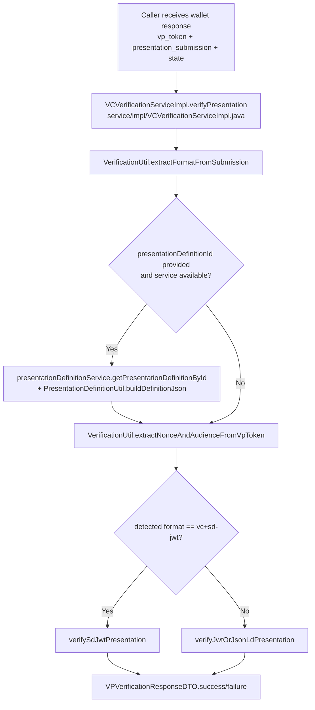
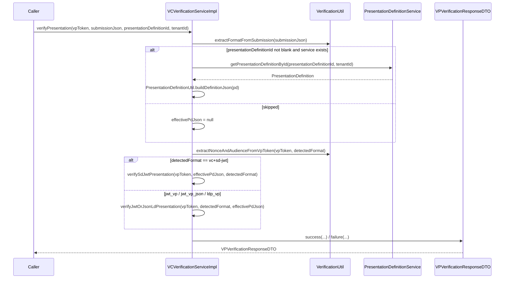
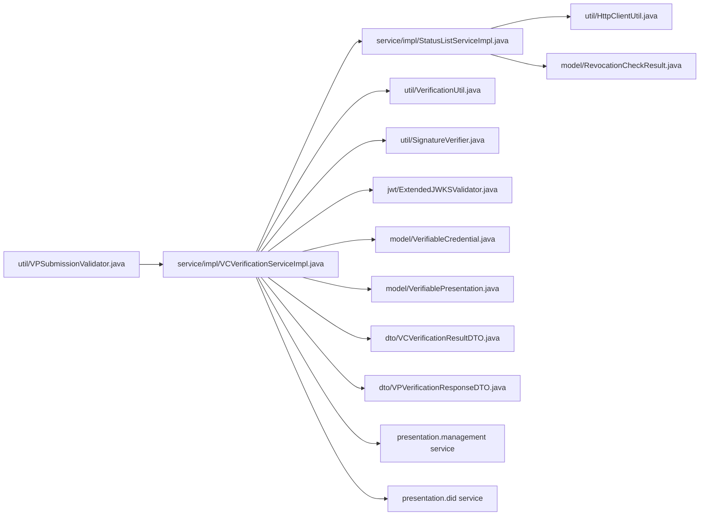
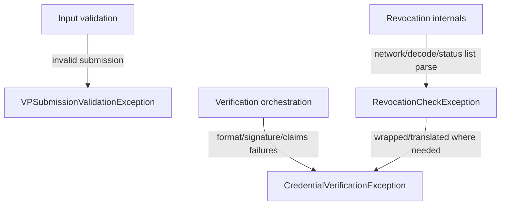

# OID4VP Verification — Mermaid Flow Diagrams (Detailed)

Use these Mermaid blocks directly in Markdown preview tools that support Mermaid.

---

## 1) Full starting-point flow (wallet submission to final response)



---

## 2) Unified method call chain with exact methods



---

## 3) JWT-VP / JSON-LD VP branch (non SD-JWT)

```mermaid
flowchart TD
    A[verifyJwtOrJsonLdPresentation]
    B[parsePresentation(vpToken)]
    C{format detected by parsePresentation}
    D[parseJwtPresentation]
    E[parseJsonLdPresentation]
    F[verifyPresentation(parsedVp)]
    G[Loop each VC in presentation]
    H[verifyCredentialInternal(vc,index)]
    I[extractClaimsFromPresentation]
    J{PD JSON present?}
    K[verifyClaimsAgainstDefinition]
    L[VPVerificationResponseDTO.success]

    A --> B --> C
    C -- JWT --> D --> F
    C -- JSON-LD --> E --> F
    F --> G --> H --> I --> J
    J -- Yes --> K --> L
    J -- No --> L
```

---

## 4) SD-JWT branch (deep verification path)

```mermaid
flowchart TD
    A[verifySdJwtPresentation]
    B[verifySdJwtToken(vpToken,null,null,pdJson)]
    C[parseSdJwtParts\nissuerJwt + disclosures + keyBindingJwt]
    D[Verify issuer JWT signature\nverifySignature(tempCred)]
    E[Validate issuer JWT time claims\nexp/nbf with skew]
    F[Resolve hash algorithm\nVerificationUtil.resolveHashAlgorithm(_sd_alg)]
    G[Hash disclosures + match _sd digests]
    H{all disclosures matched?}
    I[Fail: CredentialVerificationException]
    J{KB-JWT present?}
    K[Validate KB typ=kb+jwt]
    L[Validate KB iat freshness]
    M[Validate nonce/audience when expected passed]
    N[Validate sd_hash]
    O[Verify KB signature using cnf.jwk key]
    P{PD JSON present?}
    Q[verifyClaimsAgainstDefinition]
    R[Return verified claims map]

    A --> B --> C --> D --> E --> F --> G --> H
    H -- No --> I
    H -- Yes --> J
    J -- No --> P
    J -- Yes --> K --> L --> M --> N --> O --> P
    P -- Yes --> Q --> R
    P -- No --> R
```

---

## 5) Per-VC verification pipeline (core method)

```mermaid
flowchart TD
    A[verifyCredentialInternal(vc,index)]
    B[Check expiration with skew]
    C{expired?}
    D[Return VCVerificationResultDTO EXPIRED]
    E[verifySignature(vc)]
    F{signature valid?}
    G[Return INVALID result]
    H{vc.hasCredentialStatus?}
    I[isRevoked(vc)]
    J{revoked/suspended?}
    K[Return REVOKED result]
    L[Return SUCCESS result]

    A --> B --> C
    C -- Yes --> D
    C -- No --> E --> F
    F -- No --> G
    F -- Yes --> H
    H -- No --> L
    H -- Yes --> I --> J
    J -- Yes --> K
    J -- No --> L
```

---

## 6) Signature verification dispatch and subcalls

```mermaid
flowchart TD
    A[verifySignature(VerifiableCredential)]
    B{credential format}
    C[verifyJwtSignature]
    D[verifySdJwtSignature]
    E[verifyJsonLdSignature]

    A --> B
    B -- JWT --> C
    B -- SD-JWT --> D
    B -- JSON-LD --> E

    C --> C1[Parse JWT header via VerificationUtil.parseJwtPart]
    C1 --> C2{issuer DID?}
    C2 -- Yes --> C3[DIDResolverService.getPublicKey / getPublicKeyFromReference]
    C3 --> C4[SignatureVerifier.verifyJwtSignature]
    C2 -- No, issuer URL --> C5[resolveJwksUri]
    C5 --> C6[ExtendedJWKSValidator.validateSignature]

    D --> D1[parseSdJwtParts]
    D1 --> D2[Create temp JWT credential]
    D2 --> C

    E --> E1[Extract proof + verificationMethod]
    E1 --> E2[DIDResolverService.getPublicKey]
    E2 --> E3[SignatureVerifier.verifyLinkedDataSignature]
```

---

## 7) Revocation status list flow (including cache)

```mermaid
flowchart TD
    A[isRevoked(vc)]
    B[statusListService.checkRevocationStatus(credentialStatus)]
    C{status type}
    D[checkStatusList2021FromCredentialStatus]
    E[checkBitstringStatusListFromCredentialStatus]
    F[checkStatusList2021(url,index,purpose)]
    G[fetchAndDecodeStatusList(url)]
    H{cache hit and not expired?}
    I[return cached bitstring]
    J[fetchStatusListCredential(url) via HttpClientUtil.fetchContent]
    K[extractEncodedList]
    L[decodeStatusList\nBase64+GZIP size-limited]
    M[put into ConcurrentHashMap cache]
    N[isBitSet(bitstring,index)]
    O[Build RevocationCheckResult\nVALID/REVOKED/SUSPENDED]

    A --> B --> C
    C -- StatusList2021 --> D --> F
    C -- BitstringStatusList --> E --> F
    F --> G --> H
    H -- Yes --> I --> N
    H -- No --> J --> K --> L --> M --> N
    N --> O
```

---

## 8) Data + control interaction map by file



---

## 9) Error propagation map



---

## 10) Optional: render tips

- In VS Code, use Markdown preview with Mermaid enabled.
- For large diagrams, copy one block at a time into separate pages/slides.
- Keep diagram #1, #4, and #7 as the primary review visuals.
